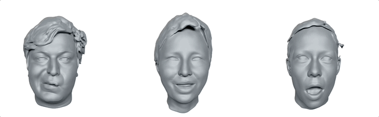

# Learning Neural Parametric Head Models (NPHM)
[**Paper**](https://arxiv.org/abs/2212.02761) | [**Video**](https://www.youtube.com/watch?v=0mDk2tFOJCg) | [**Project Page**](https://simongiebenhain.github.io/NPHM/) <br>

<div style="text-align: center">

</div>

This repository contains the implementation of the paper:

### Learning Neural Parametric Head Models 
[Simon Giebenhain](https://simongiebenhain.github.io/), 
[Tobias Kirschstein](https://niessnerlab.org/members/tobias_kirschstein/profile.html), 
[Markos Georgopoulos](https://scholar.google.com/citations?user=id7vw0UAAAAJ&hl=en),
[Martin Rünz](https://www.martinruenz.de/), 
[Lourdes Agaptio](https://scholar.google.com/citations?user=IRMX4-4AAAAJ&hl=en) and 
[Matthias Nießner](https://niessnerlab.org/members/matthias_niessner/profile.html)  
**CVPR 2023**  

If you find our code, dataset or paper useful, please consider citing
```bibtex
@inproceedings{giebenhain2023nphm,
 author={Simon Giebenhain and Tobias Kirschstein and Markos Georgopoulos and  Martin R{\"{u}}nz and Lourdes Agapito and Matthias Nie{\ss}ner},
 title={Learning Neural Parametric Head Models},
 booktitle = {Proc. IEEE Conf. on Computer Vision and Pattern Recognition (CVPR)},
 year = {2023}}
```
Contact [Simon Giebenhain](mailto:simon.giebenhain@tum.de) for questions, comments and reporting bugs, or open a GitHub Issue.


## Installation
First you have to make sure that you have all dependencies in place.
The simplest way to do so, is to use [anaconda](https://www.anaconda.com/). 

You can create an anaconda environment called `nphm` using
```
conda create -n "nphm" python=3.9
conda activate nphm
```

To install this repository and its requirements in development mode run
```
pip install -e .
```

If you plan to run a model you will need have a GPU-enabled `pytorch` version running. 
For our experiemnts we used `pytorch 1.13` and `CUDA 11.6`.  
During training this code uses `wandb` for logging purposes. `wandb` needs to be installed additionally, or removed from the code.

### Environment Paths
For simplicity we maintain a python file `env_paths.py` that defines all relevant paths, e.g. for the dataset, model checkpoints, inference results etc.  
You will have to modify these values to suit your machine.
In case you work with multiple different machines you can remove `env_paths.py` from the version control of `git` via
```
git rm --cached src/NPHM/env_paths.py
```
which allows to have a differnt version for different machines.


## Dataset

We provide detailed information on our dataset [here](/dataset/README.md).
<!---
### Demo Dataset
To get you started we provide a small dummy dataset [here](https://drive.google.com/drive/folders/1kfMRUnWxISaYQhqZxgDqakz4358VnS7k?usp=sharing) for demonstration purposes.
Download the data and place it in `dataset/dummy_data/`


Check out TODO for an example usage of of our data.


### Download
To request access to our dataset please visit this [form](https://forms.gle/fQCdunYMy5STCcSQ9).
After downloading the data place them in the folder specified in `env_paths.DATA`.
-->

## Demo

### Exploring our Data

For a first look at our please have a look [here](/dataset/README.md).


### Fitting Point Clouds

After downloading our pretained models, as described [here](https://github.com/SimonGiebenhain/NPHM#pretrained-models),
you can perform reconstruction using
```
python scripts/fitting/fitting_pointclouds.py -cfg_file scripts/configs/fitting_nphm.yaml -exp_name EXP_NAME -exp_tag EXP_TAG -resolution 256 -demo
```

### Random Sampling

You can generate randomly sampled heads in neutral expression using

```
python scripts/fitting/fitting_pointclouds.py -cfg_file scripts/configs/fitting_nphm.yaml -exp_name EXP_NAME -exp_tag EXP_TAG -resolution 256 -sample

```


## Data Preparation

Before you can start training you will need to prepare the dataset into a form that can be directly used for supervision.

To train the identity model we prepare samples on the surface for the neutral expression scan for each person, using
```
python scripts/data_processing/sample_surface.py 
```

To prepare samples of the forward deformation fields (warping from neutral expression to any other expression of a person) run
```
python scripts/data_processing/sample_deformation_field.py
```
Note that this supervision is based on our registered meshes in fixed template topology. It is also restricted to supervise the facial area.

You can state your desired output paths in `env_paths.SUPERVISION_IDENTITY` and `env_paths.SUPERVISION_DEFORMATION_OPEN`, respectively.

> **_NOTE:_**  Note that the generated files will take up around ~320GB

## Training 

NPHM is trained in two stages.

### Stage 1 - Learning Geometry in Neutral Expression

First you need to train the identity space using
``` 
python scripts/training/train.py -cfg_file scripts/configs/nphm.yaml -local -exp_name SHAPE_EXP_NAME 
```
To train NPM instead use `npm.yaml` instead and omit the `-local` argument.

### Stage 2 - Learning Forward Deformations

Afterwards, the expression space can be trained:

```
python scripts/training/train_corresp.py -cfg_file scripts/configs/nphm_def.yaml -exp_name EXPRESSION_EXP_NAME -mode compress
```

Make sure that the `nphm_def.yaml` includes the correct experiment name and epoch in the `shape_exp_name`  and `shape_ckpt` fields.
For NPM use `npm_def.yaml` and `-mode npm`.

## Pretrained Models

You can download pretrained NPM and NPHM models [here](https://drive.google.com/drive/folders/1dajUVhnYgRxbmX9CpAXDw702YYb0VHm9?usp=sharing).
Place the files into `env_paths.EXPERIMENT_DIR/`

## Inference


### Test Set
We evaluate our models by fitting back-projected single view point clouds.  
More specifically, we propose a test set consisting of *23 identities*, with varying number of expressions raning from *7 to 24 expressions*. In total it contains *427* scans.
Each expression is observed from a randomly, slightly varying frontal view. Additionally each person is observed once from the back. Each observation consists of 2500 3D points.

For inference run
```
python scripts/fitting/fitting_pointclouds.py -cfg_file scripts/configs/fitting_nphm.yaml -exp_name EXP_NAME -exp_tag EXP_TAG -resolution 400
```
which optimizes one identity and all expression codes jointly for each person. 
Results are stored in `env_paths.FITTING_DIR/EXP_NAME/EXP_TAG/`. The models as well as checkpoints are specified in `scripts/configs/fitting_nphm.yaml`. 
For NPM use `scripts/configs/fitting_npm.yaml` instead.

## Evaluation

Metrics against our ground truth scans can be computed using

```
python scripts/evaluation/eval.py --results_dir FITTING_DIR/forward_EXP_NAME/EXP_TAG/
```

We compute Chamfer-L1, Chamfer-L2, Normal Consistency and F-Scores @1mm and @5mm.
All those metrics are computed in a *point-based-fashion*, i.e. points (and normals) are sampled on reconstruction and ground truth to compute the metrics.
These samples are generated by rendering and back-projecting random views of the meshes, such that models, that reconstruct the mouth interior even if it is closed, are not punished excessively.


Finally, metrics over the full test set are gathered using
```
python scripts/evaluation/gather.py --results_dir FITTING_DIR/forward_EXP_NAME/EXP_TAG/
```
which outputs two files `FITTING_DIR/forward_EXP_NAME/EXP_TAG/evaluation/total_metrics.csv` and `FITTING_DIR/forward_EXP_NAME/EXP_TAG/evaluation/total_metrics_face.csv`
holding average metrics for the complete head and the facial region respecitively.


### Offical Metrics for NPM and NPHM

While training and inference happens in a canonical coordiante system (to be specific we use the coordiante system of FLAME and scale it by a factor of **4**), we compute metrics in the metric coordiante system in *millimeters (mm)*.

|      | ChamferL1(mm) | ChamferL2 (mm) | Normal Consitency | F-Score@1mm | F-Score@5mm |
|------|-----------|-----------|-------------------|----------|----------|
| NPM  | 2.657     | 35.896    | 0.883             | 0.478    | 0.873    |
| NPHM | 2.052     | 13.714    | 0.874             | 0.523    | 0.902    |


|      | ChamferL1(mm) | ChamferL2(mm) | Normal Consitency | F-Score@1mm | F-Score@5mm |
|------|-----------|-----------|-------------------|----------|----------|
| NPM  | 0.657     | 1.129     | 0.973             | 0.840    | 0.994    |
| NPHM | 0.531     | 0.761     | 0.976             | 0.891    | 0.997    |

> **_NOTE:_**  The number in the paper are not comparable for 2 reasons. 1: the models were trained on only 87 identities, since all remaining scans wer done afterwards. 2: the metrics are not reported in mm.
